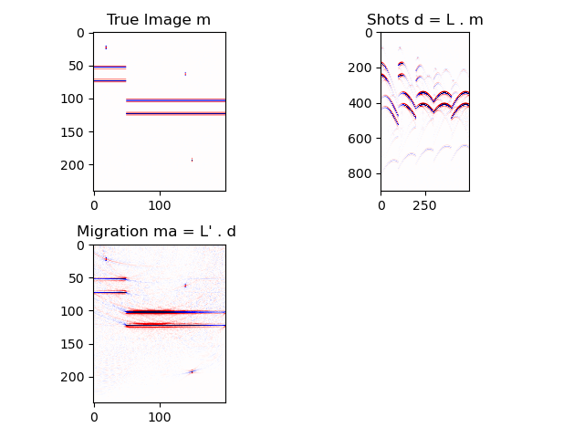

# PSTM
## Kirchhoff Migration (PSTM) tests 

Testing forward and adjoint operators for PSTM. 

The subsurface image is given by $m(z,x)$.  We consider the image an estimator of the subsurface reflectivity. The data are given by $d(t,k)$ where $k$ is trace number. Receiver and source positions are $xs(k)$ and $xg(k)$. Both
are deployed at $z=0$. 

The code *main.jl* shows how to compute:

1) Demigration $d = L m$
2) Migration $m' = L' d$ 

with $L'$ the adjoint of $L$. You can use CG or CGLS to iterative compute the regularized least-squares migration problem where $m$ is computed by minimizing

$$J = \| L m - d\|_2^2 + \mu {\cal R}(m)$$

*main.jl* runs and example

*dot_product_test.jl* checks that $L$ and $L'$ pass the dot product test

Results should look like:

