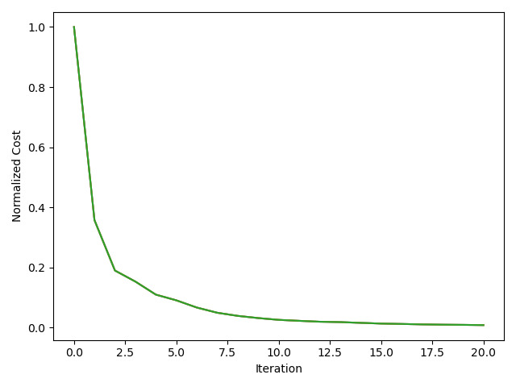

# PSTM
## Kirchhoff Migration (PSTM) tests 

Testing forward and adjoint operators for PSTM. 

The subsurface image is given by $m(z,x)$.  The image an estimator of the subsurface reflectivity. The data are given by $d(t,k)$ where $k$ is trace number. Receiver and source positions are $xs(k)$ and $xg(k)$ which are deployed at $z=0$. 

The code *main.jl* shows how to use the two operators

1) Demigration $d =W L m$  or  'd  = Operator_Conv(Operator_PSTM(m,false; Param_PSTM...), false; Param_Conv...)

2) Migration $m' = L'W' d$ or 'mig = Operator_PSTM(Operator_Conv(d,true; Param_Conv...), true; Param_PSTM...)'
3) How to use CGLS to solve the LS Migration problem for PSTM? In other words
CGLS is used to minimize the cost function J. The latter requires to use implicit form 
operators WL and L'W'

$$J = \| WL m - d\|_2^2 + \mu \| m\|_2^2$$

$L:$ is demigration and $W:$ is convolution with a wavelet which it is done in the frequency domain.

*main.jl* runs an example where I use the "invere problem crime" to model data and then retrieve the model via CGLS

*dot_product_test.jl* checks that $L$ and $L'$ pass the dot product test

Results should look like. First, we show the data which is computed via the demigration operator $L$ 

Now, I show the migrated image 

And finally, the least-sqaures migration after $20$ CGLS iterations.

To QC the problem, I also computed the cost $J$ vs. iteration number. Clearly, must converge because I am solving
a linear problem.

